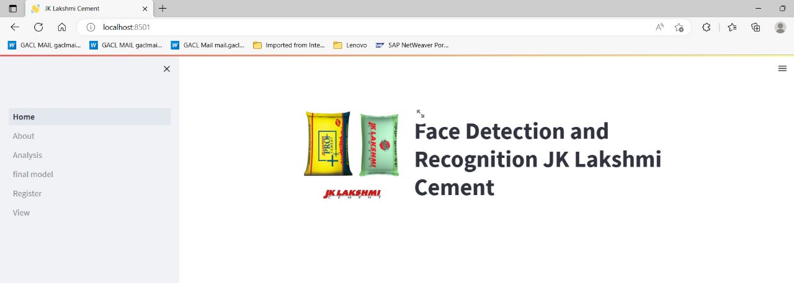
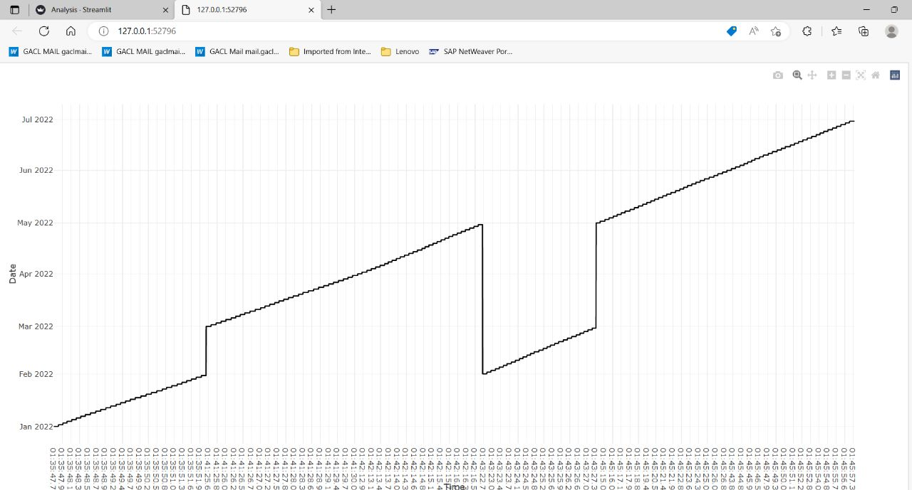
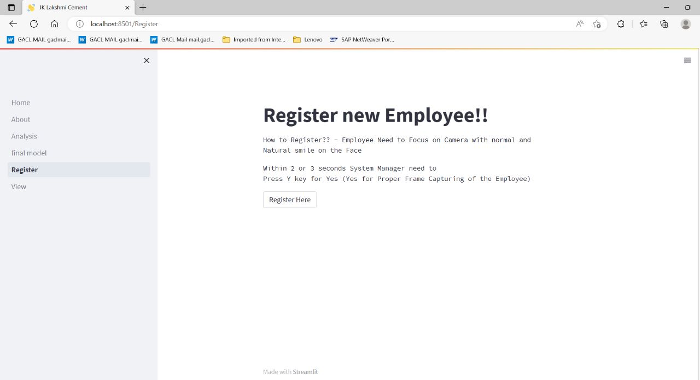
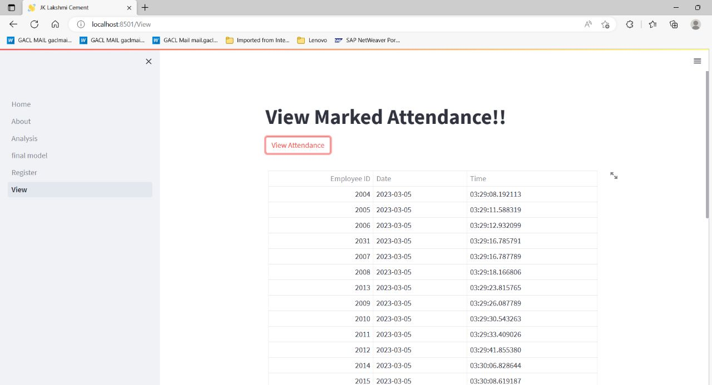
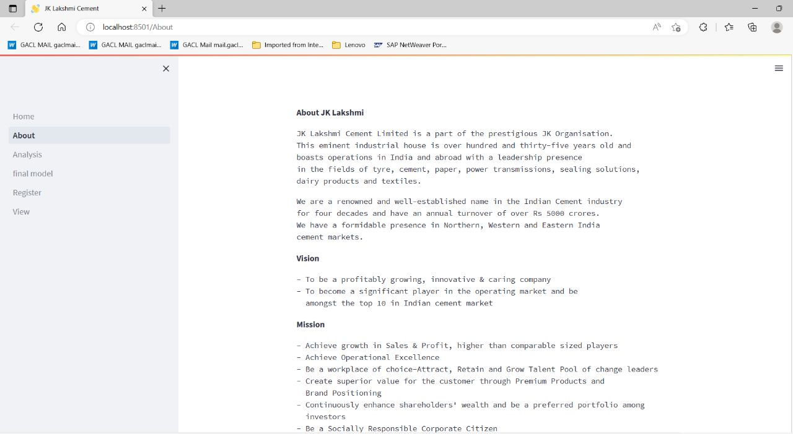

## Face Detection and Recognition

<!-- ABOUT THE PROJECT -->
## About The Project

Dashboard which will allow users to know company details, register new employees, analyze the employee reports and view the reports.

### Some ScreenShots

### Built With

* [Python](https://www.python.org/downloads/)
* [Streamlit](https://docs.streamlit.io/library/get-started/installation)
* [PyMongo](https://pypi.org/project/pymongo/)
* [Tensorflow](https://www.tensorflow.org/install)
* [FaceRecognition](https://pypi.org/project/face-recognition/)
* [Dlib](https://github.com/sachadee/Dlib)
* [CMake](https://pypi.org/project/cmake/)
* [PaperMill](https://papermill.readthedocs.io/en/latest/)
* [MTCNN](https://pypi.org/project/mtcnn/)

<!-- GETTING STARTED -->
## Getting Started

Simply download to use the application.

<!-- USAGE EXAMPLES -->
## Usage of JK Face Detection and Recognition
  <ul>
    <li>Step1: Open Home.py in any IDE's</li>
    <li>Step2: Run in Terminal streamlit run Home.py </li>
    <li>Step3: Link for the same is generated in terminal for view </li>
 </ul>

## Contributors
Vedant Modi - [@vedant8689](https://github.com/vedant8689)  
Parv Modi - [@modiparv](https://github.com/modiparv)  
Saharsh Khunt - [@saharsh-08](https://github.com/saharsh-08)  
Sanskruti Gondaliya - [@Sangondaliya](https://github.com/Sangondaliya)  
Niraj Vadher - [@NirajVadher07](https://github.com/NirajVadher07)
